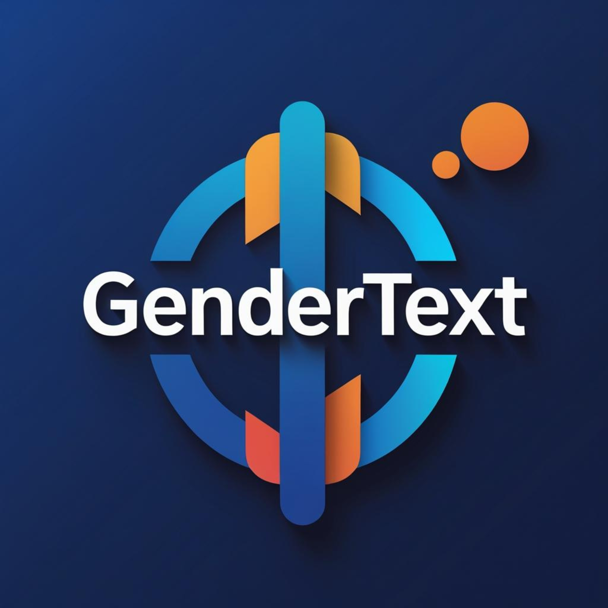

# gendertext 

**gendertext** is an R package that detects gendered language in text and
documents (`.txt`, `.pdf`, `.docx`, and more), measures how much of a text
is gendered, suggests gender neutral alternatives, and can rewrite text in
gender neutral form.

The R package itself lives in the [`gendertext/`](gendertext/) subfolder
of this repository. See its [README](gendertext/README.md) for full
documentation.

## Quick start

```r
# install.packages("devtools")
devtools::install_github("mashrur-ayon/gendertext", subdir = "gendertext")

library(gendertext)

gender_score(text = "The chairman said he will call the policeman.")
gender_suggestions(text = "Our chairman said he will email the mailman.")
gender_replace(text = "The Chairman called the policeman.")
```

## What the package does

1. **Calculate gendered versus neutral language percentages**:
   `gender_score()` reads text, PDF, or Word documents and reports the
   share of gendered and unmatched (proxy neutral) tokens.
2. **List gendered words with neutral alternatives**:
   `gender_suggestions()` extracts gendered words from a document and
   returns a table of suggested neutral replacements with counts.
3. **Rewrite text**: `gender_replace()` substitutes gendered terms with
   neutral alternatives while preserving capitalisation.
4. **Built in corpus**: the package ships with `gender_dictionary`, a
   dataset of 208 curated gendered terms and phrases with recommended
   neutral alternatives, informed by United Nations and European
   Parliament guidance on inclusive language.

## Repository layout

* [`gendertext/`](gendertext/): the R package (submit this folder to CRAN).
* [`data-raw/`](data-raw/): the raw dictionary CSV and the script that
  generates the package dataset.
* [`plots-picture/`](plots-picture/): logo and images.

## Authors

* **S M Mashrur Arafin Ayon** (maintainer) [ORCID 0000-0002-3659-2891](https://orcid.org/0000-0002-3659-2891)
* **Rodaba Zaman Adrita**: word collection and gender dictionary curation

## License

MIT. Copyright (c) 2026 S M Mashrur Arafin Ayon.
